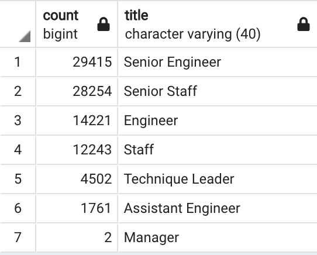
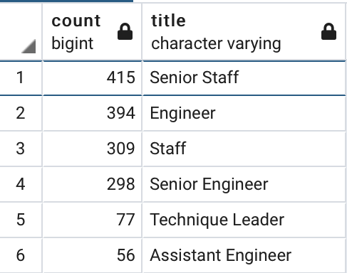
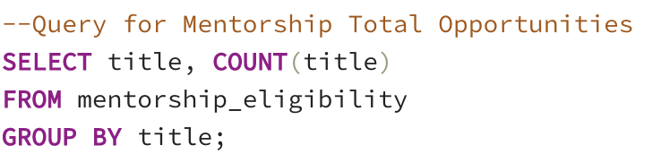

# Pewlett-Hackard-Analysis
## Overview
The purpose of this analysis was to utilize SQL and data modeling techniques in Postgres to obtain information on retiring employees. Additionally, in this module the concept of an Entity Relationship Diagram (ERD) to undertand how primary and foreign keys can be leverage to bring together multiple disparate tables into new and combined tables to support analyses. For this analysis, we wanted to (1) Identify the number of titles of current employees who are retiring and (2) Identify if there are enough qualified retirement ready employees to mentor the next generation

## Results
When looking at the results a few things standout:

-We can see that over ~57k senior-level employees are eligible for retiring (e.g., Senior Engineers and Senior Staff)

-Only 30% of the staff will be left over after the 'silver tsunami' (e.g., Staff / Total Staff including Senior)

-When we look at the count of mentors available, we can see that only 414 Senior Staff are eligible

-Only 313 Senior Engineers are eligible for mentorship

## Additional Tables or Details

